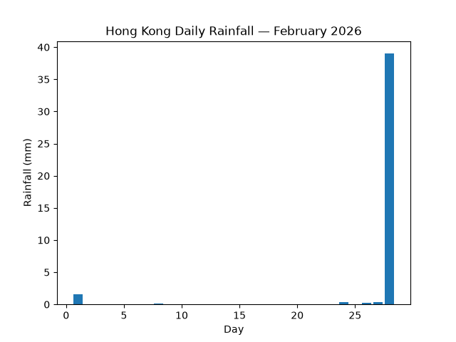

# Hong Kong Rainfall

A visualization of daily rainfall in Hong Kong in February 2026.

I chose rainfall because the Chinese character “雨” (rain) is part of my name, and I was also born on a rainy day. I chose February because my birthday is in February. These personal connections made me curious about turning rainfall data into a visual form.

## Data Source

The data comes from the Hong Kong Observatory (HKO):  
https://data.gov.hk/en-data/dataset/hk-hko-rss-daily-total-rainfall

I used the Daily Total Rainfall (mm) at the Hong Kong Observatory for 2026. The original CSV file is saved in `data/daily_HKO_RF_2026.csv`.

## Visualization

The bar chart shows the daily rainfall in February 2026. Each bar represents one day, and its height represents the amount of rainfall in millimetres.

Most days had little or no rainfall, while February 28 stands out with 39 mm of rain. The picture makes this contrast easy to see. However, it only shows the total rainfall for each day. It does not show when the rain happened during the day or how long it lasted.



## How to Run

```bash
uv run plot.py

## What I kept and changed

I kept the bar chart because it makes the difference between dry and rainy days easy to see. While writing the script, I found that some rainfall values were recorded as “Trace”, which could not be read directly as numbers, so I converted them to 0 for this visualization. I also chose to focus only on February instead of showing the whole year, because February has a personal connection to my birthday.